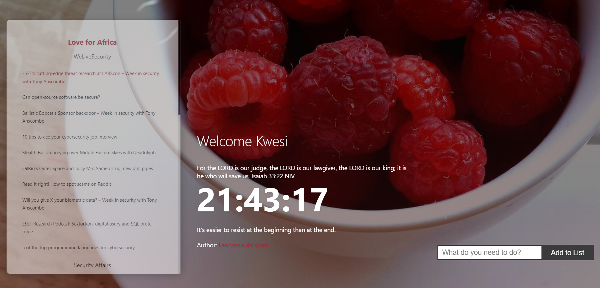

# Personalized Tab Chrome Extention

## Overview

The "Personalized Tab" Chrome Extension is a versatile new tab replacement designed to enhance your browsing experience. It provides a customized dashboard with features aimed at increasing productivity, keeping you informed, and making your browser's new tab page more personal.

## Get from Chrome

## Features

### 1. **Customization**

Tailor your new tab page to your preferences:

- **Widgets:** Add or remove widgets for timezones, news links and quotes (Bible or Random quotes).

### 2. **Productivity Tools**

Boost your daily productivity with built-in tools:

- **To-Do List:** Create and manage tasks to stay organized.

### 3. **Security News**

Stay up-to-date with the latest security news:

- **Headlines:** Get a quick overview of top security news headlines.

## Local Installation

To use the "Personalized Tab" Chrome Extension:

1. Clone or download this repository to your local machine.

2. Open Google Chrome.

3. Go to `chrome://extensions/` in your browser.

4. Enable "Developer mode" in the top right corner.

5. Click on "Load unpacked" and select the directory where you cloned/downloaded the extension.

6. The extension is now installed, and you'll see the personalized new tab page every time you open a new tab.

## Usage

- Open a new tab to access the personalized new tab page.
- Customize the page to your liking, selecting background images, colors, and widgets.
- Use the productivity tools to manage tasks, take notes, and check the weather.
- Stay informed about security news from your chosen sources.

## Contributing

We welcome contributions from the community to make this extension even better. If you'd like to contribute:

1. Fork the repository.

2. Create a new branch for your feature or bug fix: `git checkout -b feature/my-feature` or `git checkout -b bugfix/issue-number`.

3. Make your changes and commit them with descriptive messages.

4. Push your changes to your fork: `git push origin feature/my-feature`.

5. Open a pull request on this repository, explaining your changes and the problem they solve.

## Contact

If you have any questions, suggestions, or issues, please feel free to [open an issue](https://github.com/anoited007/personalized-tab/issues) on this repository.

