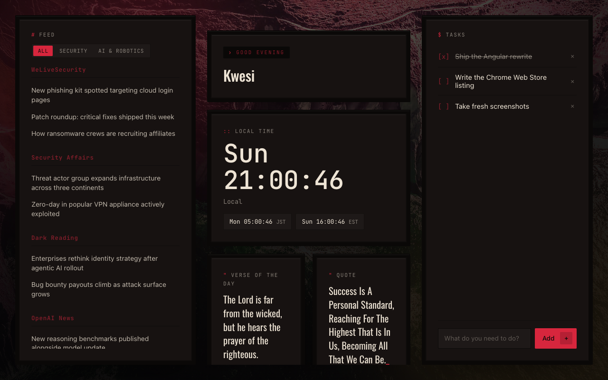

# Personalized New Tab



A fully customizable Chrome new-tab replacement: a live security and AI/robotics
research feed, a world clock, a to-do list, and daily quotes — all optional,
all toggleable, on top of your own background photo.

Built with **Angular** (a multi-app workspace: `newtab`, `options`, `popup`)
on **Manifest V3**.

## Features

- **Feed** — Security news (WeLiveSecurity, Security Affairs, Dark Reading) and
  an **AI & Robotics research** category (OpenAI, Google DeepMind, Hugging
  Face, arXiv cs.AI/cs.LG/cs.RO, IEEE Spectrum Robotics, Robohub), plus any
  custom RSS/Atom feed URLs you add. Fetched directly by the background
  service worker — no third-party CORS proxy involved. The manifest only
  declares `host_permissions` for those built-in sources; adding a custom
  feed prompts you for permission to that one domain via
  `optional_host_permissions`, rather than the extension asking for broad
  access to every site up front.
- **Clock** — a live clock across as many timezones as you want to track.
- **Quotes** — a daily Bible verse and a random famous quote, each independently
  toggleable.
- **To-do list** — a simple, locally-saved task list.
- **Greeting** — an editable name or mantra on every new tab.
- **Background ripple** — your photo ripples like water as you move the mouse
  over it (WebGL; falls back to a plain static photo where WebGL isn't
  available). Sensitivity is adjustable, and it's toggleable like everything
  else below.
- **Themes** — **Globetrotter** (mid-century travel-poster noir — flat opaque
  cards, condensed display type, sharp edges, a duotone-filtered background
  photo) or **Terminal** (the dark-glass look). A full re-skin, not just a
  color swap. Either way, pick an accent — Red, Mint, Azure, or Amber —
  it applies in both. Selectable with a live preview from the options page.
- **Settings** — every widget (greeting, feed, clock, both quotes, to-do,
  background ripple, the typing effect, and the blinking cursor) can be
  turned on or off independently, and the feed category, custom feeds,
  timezones, ripple sensitivity, and theme are all configurable from the
  options page.

## Install from source

1. `npm install`
2. `npm run build` — builds all three apps and assembles `dist-extension/`.
3. Open `chrome://extensions`, enable **Developer mode**, click **Load
   unpacked**, and select the `dist-extension/` folder.

## Development

```bash
npm start              # ng serve newtab  → http://localhost:4300
npm run start:options  # ng serve options → http://localhost:4301
npm run start:popup    # ng serve popup   → http://localhost:4302
```

Outside the extension, `chrome.storage` isn't available — the app falls back
to `localStorage` automatically (see
[`ChromeStorageService`](projects/shared/src/services/chrome-storage.service.ts)),
so the dev servers above are enough to iterate on the UI. Live feed fetches
will mostly fail in that mode (plain browser tabs don't get the
`host_permissions` CORS bypass the real extension has) — that's expected;
`npm run build` + **Load unpacked** is how to test feeds for real.

### Project layout

```
projects/
  newtab/     new-tab dashboard (feed, clock, quotes, to-do, greeting)
  options/    settings page
  popup/      toolbar popup
  shared/     services, models, and design tokens shared by all three
background/   MV3 service worker (feed/quote fetches, install defaults)
manifest.json
scripts/build-extension.mjs     assembles dist-extension/ after `ng build`
scripts/package-extension.mjs   zips dist-extension/ into releases/
Makefile                        build/zip/upload/publish — see "Publishing" below
```

## Chrome Web Store listing

**Short description** (132 char max):
> Turn your new tab into a personal dashboard: live security & AI/robotics feeds, a clock, quotes, and a to-do list.

**Detailed description**:
> Personalized New Tab replaces Chrome's new tab page with a calm, customizable
> dashboard built around what you actually want to see first thing.
>
> - **Stay current** — a live feed of security news and AI & robotics research
>   (OpenAI, DeepMind, Hugging Face, arXiv, IEEE Spectrum Robotics, and more),
>   plus room to add your own RSS feeds.
> - **Stay on time** — a live clock across every timezone you care about.
> - **Stay grounded** — a daily Bible verse and a random famous quote, each
>   optional.
> - **Stay organized** — a lightweight to-do list, saved locally, right on
>   your new tab.
> - **Make it yours** — every widget above can be switched on or off from the
>   settings page, and the feed, timezones, and greeting are all yours to set.
>
> No accounts, no tracking. Settings sync via your Chrome profile
> (`chrome.storage.sync`); everything else — your to-do list, cached feed
> data — stays on your device.

## Publishing

`make` wraps the whole release flow — build, zip, upload, publish — and both
local runs and [`.github/workflows/release.yml`](.github/workflows/release.yml)
call the exact same targets, so CI can't drift from what you run by hand:

```bash
make build     # build the three apps into dist-extension/
make zip       # + zip into releases/personalized-tab-v<version>.zip
make upload    # + upload that zip to the Chrome Web Store as a DRAFT (not live)
make publish   # publish the most recently uploaded draft — this goes live
make release   # upload + publish in one step — this goes live
make clean     # remove all build/package output
```

`upload`/`publish`/`release` need four credentials as environment variables:
`EXTENSION_ID`, `CLIENT_ID`, `CLIENT_SECRET`, `REFRESH_TOKEN`. One-time setup
to get them:

1. **List the extension once, manually.** The Chrome Web Store API can only
   update an *existing* listing, not create one — upload `make zip`'s output
   by hand at the
   [developer dashboard](https://chrome.google.com/webstore/devconsole) the
   first time. Its listing URL/dashboard gives you `EXTENSION_ID`.
2. **Create OAuth credentials.** In the
   [Google Cloud Console](https://console.cloud.google.com/apis/credentials),
   create a project (or use an existing one), enable the **Chrome Web Store
   API**, and create an OAuth **Client ID** of type **Desktop app**. That
   gives you `CLIENT_ID` and `CLIENT_SECRET`.
3. **Get a refresh token.** At the
   [OAuth 2.0 Playground](https://developers.google.com/oauthplayground):
   click the gear icon → check **Use your own OAuth credentials** → paste in
   the client ID/secret from step 2 → in Step 1, authorize scope
   `https://www.googleapis.com/auth/chromewebstore` → in Step 2, click
   **Exchange authorization code for tokens**. The **Refresh token** field is
   `REFRESH_TOKEN`.

Locally: `export EXTENSION_ID=... CLIENT_ID=... CLIENT_SECRET=... REFRESH_TOKEN=...`
then run any target above. In CI: add the same four as **repository secrets**
named `CHROME_EXTENSION_ID`, `CHROME_CLIENT_ID`, `CHROME_CLIENT_SECRET`,
`CHROME_REFRESH_TOKEN` (Settings → Secrets and variables → Actions).

The workflow pushes a new **draft** to the Web Store automatically on any
`v*` tag, plus attaches the zip to a GitHub Release — it does **not** publish
automatically. To actually go live, run the workflow manually from the
Actions tab ("Run workflow") with the **publish** checkbox on.

## Contributing

We welcome contributions from the community to make this extension even better.

1. Fork the repository.
2. Create a new branch for your feature or bug fix: `git checkout -b feature/my-feature` or `git checkout -b bugfix/issue-number`.
3. Make your changes and commit them with descriptive messages.
4. Push your changes to your fork: `git push origin feature/my-feature`.
5. Open a pull request on this repository, explaining your changes and the problem they solve.

## Contact

If you have any questions, suggestions, or issues, please feel free to [open an issue](https://github.com/anoited007/personalized-tab/issues) on this repository.
